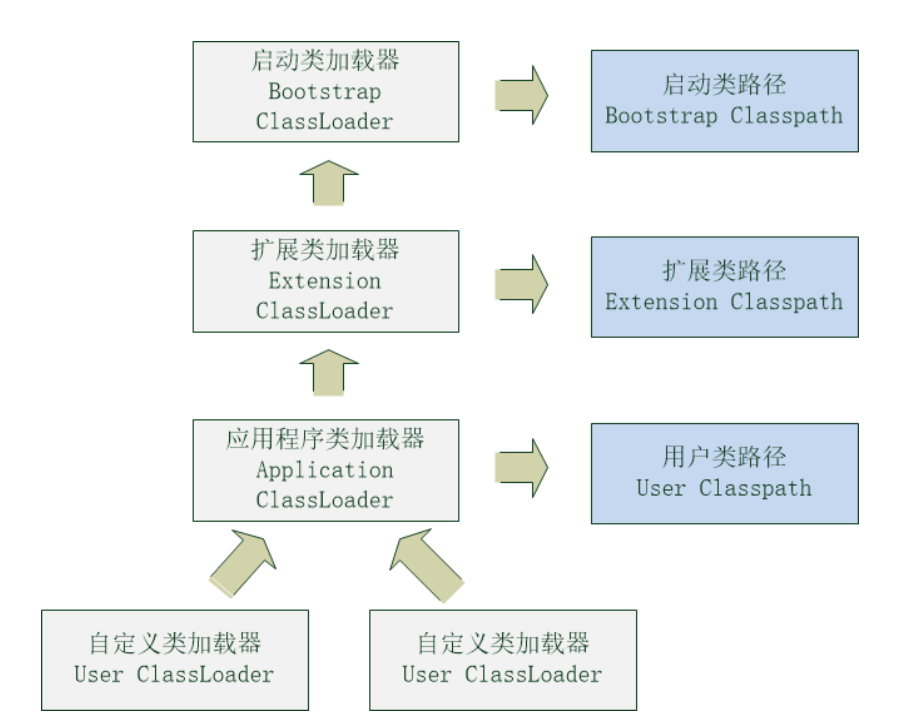

# Lab4 ClassLoader

## 0.须知

本次实验有不小的难度，请各位同学抓紧时间完成。

由于原文过长，对应内容一定一定一定要读手册，背景知识中仅能对部分重点细节做出概述，无法面面俱到。此外，中文版的规范对这部分的描述非常非常非常容易引起歧义，建议直接英文版。其中和数组相关的部分可以先不看，对于学有余力的同学可以尝试一起读了，这是未来的bonus。

类加载的知识在《深入理解Java虚拟机》的第七章中也有非常精炼易读的讲解。也可以先阅读这一节中的知识点。最重要的是，你需要通读JVM规范Chapter5 来获取更多的细节。

请先阅读教材学习知识再来做练习！！

请先阅读教材学习知识再来做练习！！

请先阅读教材学习知识再来做练习！！

## 1.实验背景

截至lab3，我们已经实现了将类的二进制表示转换为JVM内部的结构，即JClass。在接下来的实验中，我们可以使用JClass来创建“类”和“接口”。而我们要解决的下一个问题是什么时候创建这些类。

我们将使用类加载器完成这部分的工作。在JVM规范中对类加载(注意是类加载，加载只是其中的一个步骤)是这样定义的——“Java虚拟机动态地加载、链接与初始化类和接口。加载是根据特定名称查找类或接口类型的二进制表示(binary representation), 并由此二进制表示来创建类或接口的过程。链接是为了让类或接口可以被Java虚拟机执行，而将类或接口并入虚拟机运行时状态的过程。类或接口的初始化是指执行类或接口的初始化方法” 这一过程也是延迟绑定和多态的基础，即运行时才确定真正执行的类。

[JVM规范 Chapter 5](https://docs.oracle.com/javase/specs/jvms/se8/html/jvms-5.html)

本次实验将完成类加载器的加载、链接阶段。

### 1.1 双亲委托加载机制

加载阶段有一个非常重要的双亲委托机制，如图所示。（规范中只有两类，这是实际代码中的实现）



图中浅灰色的部分是类加载器，浅蓝色部分是它们对应的搜索区域。 双亲委托机制的含义是当一个类加载器收到加载请求时，它会优先将请求传递给父类，直到请求传到顶层。 从启动类加载器开始，每个加载器会首先尝试搜索自身对应的搜索区域，如果在这个过程中没有找到要加载的类，则子类再尝试自己搜索。

双亲委托机制最显而易见的优点是加载器之间具备了一定的优先级。 这能够保证在编写程序时调用的标准库、标准扩展库中的类都是唯一确定的，因为它们都是在应用类加载器之上被加载的，即官方的统一实现。

然而双亲委托机制的缺点也是十分明显的，由于各个加载器之间存在着用extends用法表示的继承关系，每个类的父类都是确定的。 当出现了在标准库中需要调第三方编写的库这样的需求时，双亲委托机制就会失效，例如Java标准中的JNDI服务。

[JNDI官方文档](https://docs.oracle.com/javase/tutorial/jndi/overview/index.html)

我们会在实验中通过一个非常简单的方法来进行加载器之间的解耦。

### 1.2 Defining & Initiating

在有了对双亲加载机制的一定了解之后，让我们来看看规范中的细节。因为每一个类加载器都非常的懒，它们会优先让自己的父类去完成搜索。那么可以肯定的是，最后一定有一个类加载器在它自己的搜索空间中找到的对应的类，这个时候最初进行委托的加载器被称为Initiating loader，而最终找到的加载器被称为defining loader。

摘一段原文，这里的L是指loader，C是要被加载的类，还有个D(这里没出现)是指引用C的类。含义是D中出现了C(不一定是显式的出现)，C如果没有被加载，那么就通过L加载C。

> If L  creates C directly, we say that L  defines C or, equivalently, that L  is the defining loader of C  
> When one class loader delegates to another class loader, the loader that initiates the loading is not necessarily the same loader that completes the loading and defines the class. If L  creates C, either by defining it directly or by delegation, we say that L  initiates loading of C or, equivalently, that L  is an initiating loader of C

从我的解读来看，defining loader和initiating loader的概念并不绝对，它们是根据出现场景不同而有不同的名字。例如，假设D的defining loader是L1，那么C被加载时也会首先去试图让L1来加载，但是由于双亲加载机制的存在，最终加载C的加载器也许是L2，那么可以说L1是D的initiating loader，L2是D的defining loader。

设置这两个概念的意义是支持双亲加载机制，当一个类的defining loader越接近上层，即越接近bootstrap loader，对应可搜索空间越少，这也就杜绝了java/lang/Object去调用你写的某个类的情况出现。

在实验中，在JClass中有一个loadEntryType，这对应了defining loader的含义。(在对规范的解读中并没有看出保留initiating loader有什么作用，因此就没有写在里面。如果有同学认为保留initiating loader可以做一些事欢迎和我们讨论~）

```java
private EntryType loadEntryType;
```

### 1.3 方法区 Method Area

在某些教材中方法区被认为是堆的一部分，也有些教材中将它称之为Non-Heap。无论教材中或者实现中是如何划分它的，方法区的作用就是存放类信息的，在我们的框架中即JClass(运行时常量池是JClass的一部分)。每当有类被加载进JVM中，类的相关信息就要被储存进方法区。

在JVM中，一个类由完全限定名(之前的作业中提到过)和类加载器来唯一确定一个类。那么能出现由boostrap loader加载的java/lang/Object类和user loader加载的java/lang/Object类共存的情况吗？理论上可以 ，但是双亲加载机制杜绝了它。(如果你没能理解这个逻辑，建议再回到前一部分理解一下)

代码中为了简化理解，只是用了完全限定名来保证唯一性。

储存这件事情本身的最终目的就是加快访问。方法区作为JVM的一部分存储，在加载类之前会首先尝试直接获取这个类的信息，如果方法区中没有就再进行加载。

### 1.4 解析

解析的根本目的是为了实现延迟加载，延迟加载的根本目的是节省时间和空间。试想，如果不存在延迟加载，那么JVM必须一次性将所有的要用到的类加载进内存，首先这会在启动时带来巨大的延迟，并且会...

...  
并且会占用更多的内存。而使用了延迟加载之后，只有当使用到某个类时才会加载这个类，并且在JVM检测到这个类不需要时又会释放对应的空间。

为了支持延迟加载，JVM把“需要引用某个类”这个信息变成了一个运行时常量池中的常量，这类常量叫做Ref引用。而解析就是将引用变为真正的类并加载到内存的过程。

更多的解析算法你需要去阅读JVM规范对应章节，其中本次只需要用到类和接口的解析算法，其他可以暂时不看。

## 2.实验要求

因为实验整体要求就是基本按照JVM规范所规定的细节来模拟正确的流程，所以不是很好形式化。大致内容如下，部分细节会在2.3中说明，其余请参考代码中的注释提示以及实验指导：

1. 完成ClassFileReader中的双亲委托机制  
2. 完成ClassLoader中的defineClass方法  
3. 完成ClassLoader中的link阶段的prepare方法  
4. 完成SymRef中的resolveClassRef方法  
5. 完成JClass中的权限验证: 参考规范要求(代码指导中会给出示例)

### 2.1 实验输入

测试中会调用的接口：ClassLoader中的loadClass，ClassRef中的resolveClassRef。其余接口由框架代码实现，不要随意删除即可。除了这两个方法以外的，实验要求中完成的方法都是可以更改的。我们这样进行划分只是为了在理解时更贴近JVM规范的语义，你可以自由实现。

### 2.2 实验输出

抛出所有的ClassNotFoundException和IllegalAccessException，无异常时没有任何输出。

### 2.3 实验要求(部分细节，更多请参考实验指导)

加载时的顺序严格遵守：递归加载父类 -> 按顺序加载自身的所有接口。需要注意接口之间也可以继承。一个例子是 A extends B implements C， B implements D，那么加载A的时候应该按顺序的加载结果是：

```
java/lang/Object → B → C → A，没有D
```

## 3.实验指导

### 3.1 双亲加载

双亲加载看起来上面写了非常长的一段，但实际上实现起来并不困难，在实验中不到10行就可以解决它。

```java
/** 
 * @param className class to be read
 * @param privilege privilege of relevant class
 * @return content of class file and the privilege of loaded class
 */
public Pair<byte[], Integer> readClassFile(String className, EntryType p) {
    String realClassName = className + ".class";
    realClassName = PathUtil.transform(realClassName);
    //todo
    /**
     * Add some codes here.
     *
     * You can pass realClassName to readClass()
     *
     * Read class file in privilege order
     * USER_ENTRY has highest privileges and Boot_Entry has lowest privi
     * If there is no relevant class loaded before, use default privilege
     * Default privilege is USER_ENTRY
     *
     * Return the result once you read it.
     */
    throw new ClassNotFoundException();
}
```

如之前作业中定义的那样，我们使用了Entry类来表示加载器，每个Entry拥有一个搜索路径classpath。在readClassFile方法中。我们稍微进行了一点修改，参数是要寻找的类的类名以及一个用来表示权限的EntryType变量。EntryType是一个枚举类实现，它使用int值定义了一组权限，有一点类似unix系统中用户权限的意思。枚举类中的每个变量int值越大意味着这个权限越高。

在方法具体实现时，每当传入的权限大于一个默认权限值，就拥有更多的搜索空间。方法的返回值会默认把实际加载了这个类的Entry的权限返回，而当需要加载这个类的父类和接口时会将这个类的权限传入，假设当前类是扩展标准库中的某个库，它的父类和接口就不可能来自userClasspath这个加载器。这样就可以保证被加载的库不向下调用库，支持双亲委托机制。

而在面对双亲委托模型无法应对的需求时，这个框架十分易于扩展的。比如需要打破不向下调用这一限定。 一种做法是增加一个介于权限A和B(A权限小于B)之间的新的权限N，并在原本返回A的位置返回N。 接着定义一个新的ENTRY并将权限赋值为N，通过某种方式查找文件。 这样就间接扩展了加载器的搜索范围，且不用担心破坏双亲委托机制。 此外，如果想要将标准库中的一些实现替换为自定义的库实现，也可以通过稍微调整权限判断的顺序和加载器对应权限的方式来办到这件事，消除了原本的继承关系的限制。

在这部分中你还需要思考的问题就是如何分配权限。将权限与Entry对应起来并按照一定的顺序去试图获取要加载的类就可以实现双亲委托机制了~

```java
public class EntryType {
    public final static int LOW = 0x1;
    public final static int MIDDLE = 0x3;
    public final static int HIGH = 0x7;
}
```

### 3.2 defineClass

defineClass方法对应于规范5.3.5节，主要做四件事(对规范的规定做了一点简化)：

1. 检查是否已经规定了加载器，如没有则正常进行，如有则抛出异常。因为我们只实现单线程，这里是不会出现多线程中多个线程同时加载一个类导致并发bug的情况，故直接将二进制结果转换成JClass即可 (我们已经帮你写了)
2. 递归加载父类
3. 加载类的接口(不用递归)
4. 设置类的defining loader，即更新JClass的loadEntryType，并将JClass加入方法区

在代码中loadNonArrayClass方法在读取到二进制表示的同时获取到了definingEntry，加入方法区。方法区中有什么API请自行查看源码Method Area，如果没有接触过单例的设计模式也可以延伸学习一下~

```java
/**
 *
 * define class
 * @param data binary of class file
 * @param definingEntry defining loader of class
 */
private JClass defineClass(byte[] data, EntryType definingEntry) throws {
    ClassFile classFile = new ClassFile(data);
    JClass clazz = new JClass(classFile);
    //todo
    /**
     * Add some codes here.
     *
     * update load entry of the class
     * load superclass recursively
     * load interfaces of this class
     * add to method area
     */
    return clazz;
}
```

需要注意类加入方法区的时机，测试中会严格检查添加的顺序。不用担心方法区中使用Map的实现，LinkedHashMap是有序的。

### 3.3 prepare

这部分内容已经实现了大半，你需要去了解在准备阶段默认值是如何规定的。不要想当然，可能会和你理解的有出入。规范上这部分分别对应了5.4.2和2.3-2.4。

因为Java语言中，基本类型的变量无法当成对象，装箱之后又无法新增接口。因此代码中使用`constant`接口和`wrapper`来统一包装了基本类型变量。你可以在源码中找到它们，注释中有对应的使用方法示例。

此外，你还需要学习一下`Vars`结构体。在先前的作业中我们已经使用了槽位`Slot`这个概念，现在你可以看到Slot的具体实现了。在讲解Slot之前我们需要讲解一下类中的成员。

类中的成员主要为两类：

- 一类是对象引用，例如：`String myString`
- 另一类则是基本类型，例如：`int a`

而我们的需求是使用一个统一的结构体来存储这些成员，即`Vars`，用来表示一个类或实例中的所有成员。`Vars`就是一个`Slot`的数组，而`Slot`中包含了对象和值中的一个。类似于C语言中的`union`的作用，虽然Java做不到C语言那样复用空间。`JObject`代表所有的对象，`NullObject`代表null，而`value`则统一使用了`Integer`，因为Java中所有的值都可以转换为int类型。

从这里也可以看出long和double占用两个slot的原因——int只有32bit，而long和double都是64bit类型。

```java
public class Slot {
    private JObject object;
    private Integer value;
}

public class Vars {
    private Slot[] varSlots;
    private int maxSize;
}
```

### 3.4 解析classRef

完成这个要求你需要完全理解`SymRef`的结构。每个SymRef都持有一个对自身所在运行时常量池的引用，而运行时常量池中包含了对所属类的引用。再获取到目标类就可以进行验证并加载。验证部分就是3.5的部分，检查D对C的权限。

### 3.5 权限验证

JVM规范中的规定如下：

> A class or interface C is accessible to a class or interface D if and only if either of the following is true:
>
> - C is public.
> - C and D are members of the same run-time package.

要验证这两个条件，我们在`JClass`类中提供了一些辅助的方法，如：

- `isPublic()`
- `getPackageName()`

在之后的作业中，也许你还需要仿照着这些方法来实现更多方法以帮助你进行对某个属性的判断。

在权限验证时如果不满足访问权限则抛出 `IllegalAccessException`。

在设计测试用例时我们发现了一个有趣的问题。这三个类在同一个包中，猜猜`Visitor`中哪一句可以过编译？

```java
public class Visitor {
    Visible1.Unknown v1 = new Visible1.Unknown();
    Visible1.Unknown v2 = new Visible1.Unknown();
}

public class Visible1 {
    private static class Unknown {}
}

class Visible2 {
    public static class Unknown {}
}
```